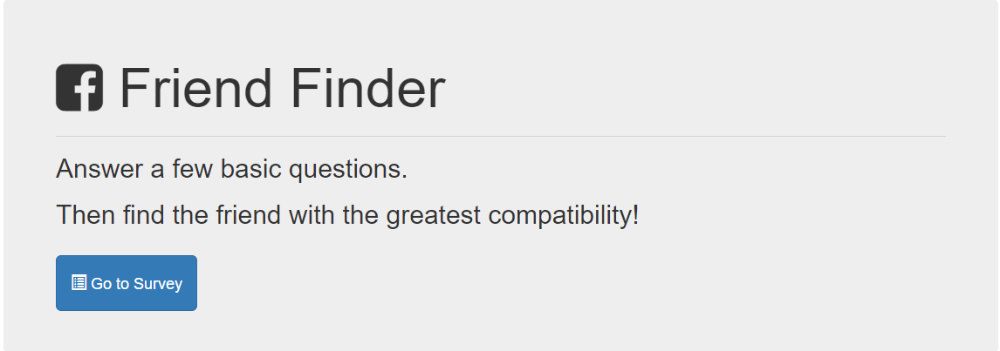
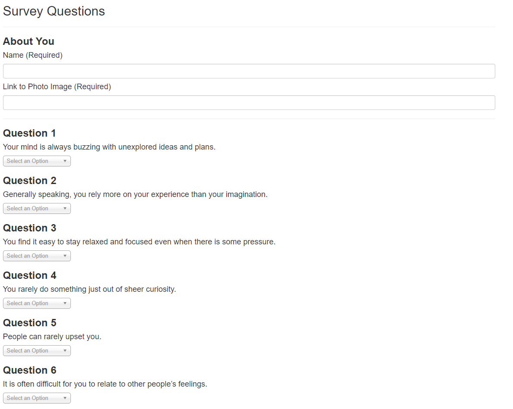

# FriendFinder

The goal was to create a Friend Finder app (essentially a dating app but for friends) using Node and Express servers. The user enters the page that leads to a survey. When the user submits the survey, they are matched with a "friend" that has the closest match to their personality.

## Getting Started
https://murmuring-forest-50688.herokuapp.com/

## Screen Shots


Home Page


Survey

## Technologies used
- Node.js
- express NPM Package - https://www.npmjs.com/package/express
- path NPM Package - https://www.npmjs.com/package/path

### Prerequisites

- Node.js - Download the latest version of Node https://nodejs.org/en/
```

## Built With

* VSCode Text Editor

## Author
Douglas Boyce
